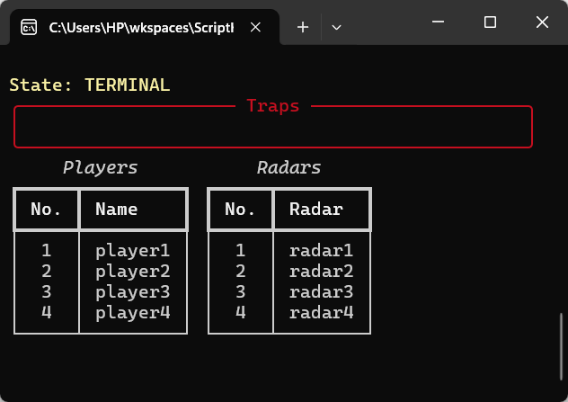
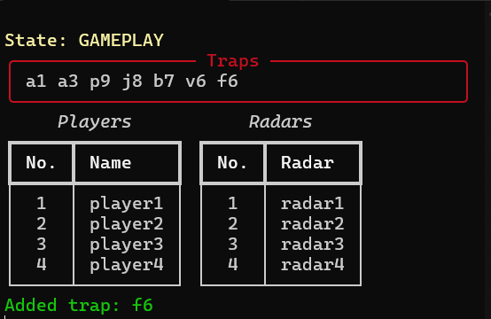
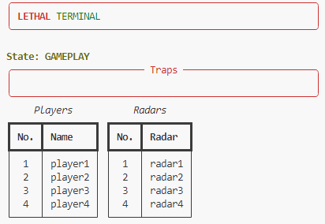

# Lethal Terminal

'Lethal Terminal' is an advanced terminal tool for automating disarming mines, turret, and easily performing macros with vim motions.

<p align="center">
  
</p>

## Download

To download the executable, download the zip from [Download Link](https://github.com/AllanKoder/Lethal-Terminal/blob/master/download). Keep in mind, this is for **Windows** only.

You can also use pyinstaller to install the executable yourself.

## Features
- Automatically typing all the mines and turrets every 5 seconds (configurable)
- Using Vim-like motions to switch between different states: ex: adding traps, removing, inputting text.
- Macros for:
    - switching player
    - pinging radar
    - flashing radar
    - transmitting messages
    - view monitor

<p align="center" style="padding: 20px">
  
  <br>
  <i>Gameplay GIF</i>
</p>

<br>

<p align="center" style="padding: 20px">
  
  <br>
  <i>Terminal UI GIF</i>
</p>

<br>

<p align="center" style="padding: 20px">
  
  <br>
  <i>Terminal UI to display state</i>
</p>

<br>

<p align="center" style="padding: 20px">
  
  <br>
  <i>Light mode</i>
</p>


## Guide (How to Use)

Getting used to vim controls is tricky at first, here is a chart of the states and the transition commands between them:

> Note: 'trap' means a mine, a turret, or the spike trap

| **State**            | **Description**                                    | **Key Commands**                      |
|----------------------|----------------------------------------------------|---------------------------------------|
| **Gameplay**         | Normal Lethal Company gameplay happens here     | `t + enter` → **Terminal**                |
| **Any State (except Gameplay)**         |           | `control + c` → Return to **Terminal** state |
| **Terminal**         | Command input state for various actions.           | `tab + tab` → Gameplay <br> `a` → Add Trap <br> `x` → Remove Trap <br> `i` → Insert Text <br> `s` → Switch User <br> `t` → Transmit Text <br> `v` → View Monitor <br> `p` → Ping Radar <br> `f` → Flash Radar <br> `q + q` → Toggle All Traps |
| **Add Trap**         | Add a new trap to the trap list.     | Backspace to delete, then enter trap (e.g., a1) |
| **Remove Trap**      | Remove a trap from the trap list.     | Backspace to delete, then enter trap (e.g., a1) |
| **Insert Text**      | Insert text into the terminal.        | Any character input followed by `enter` |
| **Switch User**      | Switch between users.                 | `s` → types 'switch' <br> `<player number from table>` → 'switch <player name>' |
| **Transmit Text**    | Transmitting a message.                  | Type message and press `enter`       |
| **Ping Radar**       | Flashes a specific radar.                           |`<radar number from table>` → 'ping (radar name)'             |
| **Flash Radar**      | Flashes a specific radar.                          |`<radar number from table>` → 'flash (radar name)'             |
| **Toggle Traps**     | Toggles writing all possible traps.           | Triggered by pressing `q + q` from **Terminal**         |
| **View Monitor**     | types 'view monitor'.                     | Triggered by pressing `v` from **Terminal**             |
> Please note that once in any state (except gameplay), pressing  **control + c** will return back to **Terminal** state.

It will take some time to practice and get used to using this tool. I recommend trying it out on a notepad document before using it in game.

### Starting out tutorial

1. Run the executable, `lethal_terminal.exe`
    - Ensure that there is a `config.json` file in the same directory
1. Keep the UI open on one half of the screen and the other half is a text editor
1. Press `t+enter` in the text editor to begin **Terminal** state
1. Mess around with various states like `a` to add a trap, in the `Add Trap`
1. After adding a trap, notice that you will start to type the list of traps automatically
1. Next, go to `Insert Text` state, by pressing `i` in the **Terminal** State
    - Start typing whatever you want now
1. Even while traps are being automatically written, you can still write whatever you want
    - Experiment with the text insertion
1. To return from insert text back to **Terminal** state, press `control + c`
1. You got the basics down, now mess around with the other states!


### Editting the Configuration

In the `config.json` file, you can edit various variables around: 
| Parameter                | Description                                           | Default Value                          |
|--------------------------|-------------------------------------------------------|-------------------------------------|
| `KEYBOARD_INPUT_DELAY`   | The delay (in seconds) between keyboard inputs.      | 0.020 seconds                       |
| `TRAP_TIMER_DURATION`    | The duration (in seconds) which automatic trap writing occurs | 5 seconds                          |
| `LOG_LEVEL`              | The logging level for the application. Only change if you want to debug the application | 20 (WARNING) |
| `PLAYERS`                | A list of player names for `switching`    | ["player1", "player2", "player3", "player4"] |
| `RADARS`                 | A list of radars for `ping` and `flash`       | ["radar1", "radar2", "radar3", "radar4"] |


## Development
❤️ First of all, thank you for considering development with this project 

### Getting Started

> Optional, but recommended: Set up a python virtual environment `python -m venv .`

To get started with development, install the required pip libraries:
```sh
pip install -r requirements.txt
```

#### Running the code
Then, you can running the program as follows:
```sh
python lethal_terminal.py
```

#### Debugging

Since the terminal is being used as the UI with Rich, we use logging to debug the application. In the `config.json`, you can set your logging level to the respective numerical value, ideally `10` for debugging

> https://docs.python.org/3/library/logging.html#logging-levels

The logs will be located in `lethal_terminal.log`

#### Building

Building the executable
```sh
pyinstaller.exe .\lethal_terminal.py --icon .\assets\lethal_terminal.ico
```

## Known Issues

These are the problems which are known, and are tricky to fix, but are being worked on:

- Holding down a macro may result in misprints
    - Example: Holding `s + s` in **Terminal** state will result in inputs like `siwthc` instead of `switch`
- While the system is automatically typing traps, there is a small chance that your input will be written when it's not supposed to
    - Example: system types `a1 a2 a3 a4`, user enters `Text` mode and holds down the key `b`, the terminal output may be `a1 a2 ba3 a4`
- Sometimes, the first few keys in the macros are not written correctly. This may be a case of the keyboard needing some time to 'warm up' or your `KEYBOARD_INPUT_DELAY` in the `config.json` is too high
